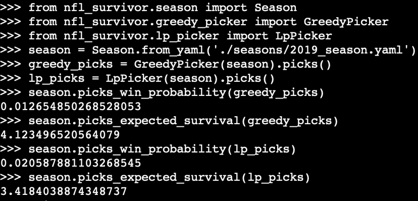

# NFL Survivor Pool Picker 🏈

Found yourself in an NFL Survivor Pool but don't know anything about football? Don't worry, we've got you covered.

NFL Survivor Picker is a command line application to help you make picks in NFL Survivor Pools. Features include
* Scraper to fetch probabilities for all games in NFL season from fivethirtyeight.com
* Read in user specified NFL season and game probabilities
* Make picks using greedy algorithm or globally optimal linear programming algorithm


## Installation

To install simply clone the repo, navigate to the directory and `pip` install from the setup file.

```
git clone https://github.com/mnalpert/nfl_survivor.git
cd nfl_survivor
pip install -e .
```

## Usage

The two commands available are `make_picks` and `scrape_538`.

### Make Picks

`make_picks` will determine picks for an NFL season (either input as a year and then scraped or as a path to a custom NFL season) and then write them to an output file or print to standard out. The picks can either be made with a linear programming or greedy algorithm. Finally, if you have already made picks in the season or are otherwise locked in to picking certain teams in certain weeks this can be specified in a file and input to the algorithm.
```
Usage: make_picks [OPTIONS]

Make picks for a given season and set of previous picks

Options:
-pp, --previous_picks TEXT  File path to YAML file with previous picks
-p, --picker TEXT Name of picker to use when making picks (lp | greedy)
-o, --output TEXT YAML file path to write picks to
-y, --year INTEGER  Year to scrape season for
-s, --season TEXT File path to season YAML. Takes precedence over year

--help  Show this message and exit.
```

Some sample commands  and their behaviors are
* `make_picks -y 2019 -o 2019_picks.yaml` will first scrape the 2019 season from fivethirtyeight.com and then make picks and write them to `2019_picks.yaml`
* `make_picks -s seasons/greedy_counterexample.yaml -p greedy` will use the season specified in `seasons/greedy_counterexample.yaml` and use the greedy picker to determine picks. Since no output file is specified it will print the picks to standard out
* `make_picks -y 2019 -pp previous_picks.yaml` will use the scraped 2019 season to make picks and respect the previous picks given in the file `previous_picks.yaml`

### Scrape From 538

`scrape_538` will scrape a given year's NFL season from fivethirtyeight.com and then write the season to an output file or print to standard out.

```
Usage: scrape_538 [OPTIONS]

Scrape NFL season for a given year with probabilities from
fivethirtyeight.com

Options:
-o, --output TEXT YAML file path to write season to
-y, --year INTEGER  Year of season to scrape
--help  Show this message and exit.
```

Some sample commands and their behaviors are
* `scrape_538 -y 2019 -o seasons/2019_season.yaml` will scrape the 2019 season into the file `seasons/2019_season.yaml`
* `scrape_538 -y 2018` will scrape and print the 2018 season to standard out

## Background

NFL Survivor is a fantasy sports game where participants pick one NFL team per week to win their matchup. If the picked team wins then the participant stays in the pool but if they lose then they are out of the game. The tricky bit is that a participant cannot pick the same team more than once. The last participant standing is crowned the winner of the pool (subject to tiebreakers if multiple participants have no losses at the end of the 17 week season).

## Algorithms

For the sake of our analysis we will assume that the probabilities that teams win their matchups in each week of the NFL season is given to us. Our problem is how to optimally pick one team for each week of the season without picking the same team twice. Optimality means that the probability of making it through the entire season is the highest.

### Greedy Algorithm

An intuitive approach is to make our picks greedily. That is, in week one we select the team with the highest win probability. This team is now labeled "picked" for the sake of selecting future teams. In each subsequent week we select the team with the highest win probability across all teams that we have not yet "picked" and add it to our set of "picked" teams. In this way, we pick a unique team per week for each week of the season.

For example, we may have the season

| Week 1  | Probability | Week 2  | Probability |
|---------------------|-------------|---------------------|-------------|
| NY Giants | 0.75  | NY Giants | 0.99  |
| NY Jets | 0.25  | Dallas Cowboys  | 0.1 |
| | | | |
| Dallas Cowboys  | 0.45  | NY Jets | 0.55  |
| Philadelphia Eagles | 0.55  | Philadelphia Eagles | 0.45  |

In the first week we pick the NY Giants since they have the highest win probability in that week. In the second week, the NY Giants again have the highest win probability but we have unfortunately picked them already. In week 2, we settle for the highest win probability across all teams we haven't picked yet which is the NY Jets.

This example illustrates that the greedy algorithm may not produce a set of picks that has the optimal probability of making it through the entire season. With the picks determined by the greedy algorithm we have a probability of $0.75 \cdot 0.55 \approx 0.41$ of making it through the season. However, the optimal set of picks are taking the Philadelphia Eagles in week 1 followed by the NY Giants in week 2 which has a probability of $0.55 \cdot 0.99 \approx 0.54$ of making it through the season. Our greediness forced us to into picking the NY Giants in week 1 and then forbid us from selecting them again in their blowout matchup in week 2. We were better off picking a lower probability team in week 1 to save the NY Giants for our week 2.

You can run `make_picks -s seasons/greedy_counterexample.yaml -p greedy` and `make_picks -s seasons/greedy_counterexample.yaml -p lp` to see this in action for the greedy picker and linear programming picker respectively.

Further, the greedy approach may not even successfully determine a team to pick for every week of the season. If our greediness forces us to pick a set of teams in the first $n$ weeks and then in week $n + 1$ the only teams playing are the ones we picked in weeks $1$ through $n$ then we will not be able to select a team in week $n + 1$. The schedule below shows such an example

| Week 1  | Probability | Week 2 | Probability | Week 3 | Probability |
|-----------|-------------|----------------|-------------|----------------|-------------|
| NY Giants | 0.9 | NY Jets  | 0.2 | NY Giants  | 0.7 |
| NY Jets | 0.1 | Dallas Cowboys | 0.8 | Dallas Cowboys | 0.3 |

In week 1 we pick the NY Giants and then in week 2 we pick the Dallas Cowboys. However, this leaves us without a team to pick in the third week's matchup between the NY Giants and the Dallas Cowboys. However, in practice this will likely not be an issue for the algorithm since real life NFL schedules are not this pathological.  There are 32 NFL teams playing across 17 weeks with generally only two teams having a bye per week which always leaves enough teams to be picked even at the end of the season.

### Linear Programming Formulation

The problem of picking a team for every week of the season can be solved in a globally optimal way by formulating it as a linear program. Let us define a few variables
* $W$ is the number of weeks in the season. Weeks will be indexed by the numbers 1 through $W$
* $T$ is the number of teams in the league. Teams will be indexed by the numbers $1$ through $T$
* $p_{w, t}$ is the probability that in week $w$ team $t$ wins where $w \in \{ 1, 2, \ldots, W \}$ and $t \in \{ 1, 2, \ldots, T \}$
* $s_{w, t}$ is an indicator variable which is $1$ if we pick team $t$  in week $w$ and $0$ if not

The $s_{w, t}$ are the variables we would like to figure out and will indicate which team we pick for each week.

To formulate the problem as a linear program we must specify linear equations or inequalities capturing the constraints and a linear expression that represents the objective. The two constraints we need to impose are picking exactly one team per week and not picking the same team twice. The objective to be maximized is the probability of winning every week in the season.

#### Pick Exactly One Team Per Week

The constraint to pick exactly one team per week can be written in terms of our indicator variables as

$$ \sum_{t=1}^T s_{w, t} = 1 \quad \forall w $$

Since the $s_{w, t}$ are either zero or one this constraint says that exactly one of them is $1$ per week or in other words that we pick exactly one team per week.

#### Don't Pick Same Team Twice

The constraint to not pick the same team twice can be written in terms of our indicator variables as

$$ \sum_{w=1}^W s_{w, t} \leq 1 \quad \forall t$$

Since the $s_{w, t}$ are either zero or one this constraint says that at most one of them can be $1$ for each team or in other words the same team cannot be picked more than once
#### Maximize Win Probability

The simplest expression equal to the probability of winning every week in the season is

$$ P = \left( \sum_{t=1}^T s_{1, t} \cdot p_{1,t}\right) \left( \sum_{t=1}^T s_{2, t} \cdot p_{2,t}\right) \cdots \left( \sum_{t=1}^T s_{W, t} \cdot p_{W,t}\right) $$

The expression in the first set of parentheses is the probability that we win with our picks in week 1 since the only nonzero $s_{1, t}$ is for the team that we have picked in week 1. Similarly, the expression in the $i$ th set of parentheses is the probability that we win in the $i$ th week. Multiplying across all the weeks of the season gives the probability that we win every week of the season.

Unfortunately, this expression is not linear and therefore cannot be used as an objective expression in a linear program. Luckily, we can write the probability of winning every week in the season in a different way that allows for a transformation into a linear expression. The following expression is also equal to the probability of winning every week of the season

$$ P = \left( \prod_{t=1}^T p_{1, t}^{s_{1, t}} \right)  \left( \prod_{t=1}^T p_{2, t}^{s_{2, t}} \right) \cdots \left( \prod_{t=1}^T p_{W, t}^{s_{W, t}} \right) = \prod_{t=1}^T \prod_{w=1}^W p_{w, t}^{s_{w, t}}$$

The expression in the $i$th set of parentheses is the probability that we win in the $i$th week and multiplying across all the weeks gives the probability that we win every week of the season.

At first glance this doesn't seem to help us very much since this expression is also nonlinear in the $s_{w, t}$. However, we can just as well maximize the logarithm of this expression since logarithm is a strictly increasing function. The arguments which maximize a function will also maximize a strictly increasing function applied to the function. Thankfully for us the logarithm of the above expression will be linear

$$ \log P = \sum_{t=1}^T \sum_{w=1}^W s_{w, t} \cdot \log p_{w, t} $$

and this expression can be used as the objective in our linear program.

## Results

We can compute the win probabilities and expected survival times for the 2019 season using picks determined by the linear programming and greedy algorithms.

Using the scraped 2019 season from fivethirtyeight.com and running both the linear programming and greedy pickers we can find the win probabilities and expected survival for each set  of picks.

| Picker\Metric | Win Probability | Expected Survival |
|---------------|-----------------|-------------------|
| Greedy Picker | 0.0127          | 4.123             |
| LP Picker     | 0.0206          | 3.418             |

The LP picker does indeed give us a higher probability of winning every week of the season but interestingly lowers our expected survival time.

The follow REPL shows the methods used to compute the picks and associated metrics



## Contributors

* Matt Alpert -- mnalpert1@gmail.com
